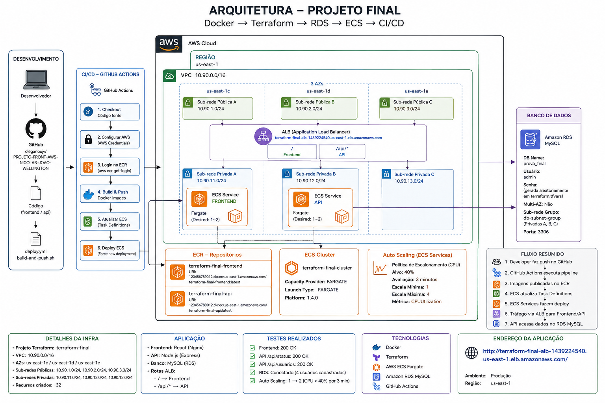
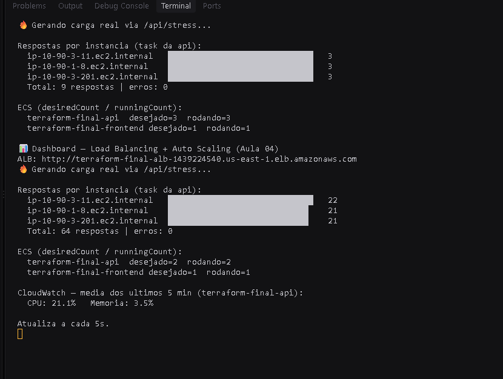

# terraform-final

Infraestrutura AWS completa provisionada com Terraform: VPC multi-AZ, ALB, ECS Fargate (frontend + API), RDS MySQL, Auto Scaling, observabilidade (CloudWatch Dashboard + Alarme SNS) e deploy automatizado via GitHub Actions.

## Arquitetura



- **Rede**: VPC `10.90.0.0/16` em 3 AZs (`us-east-1c`, `us-east-1d`, `us-east-1e`), com sub-redes públicas (ALB) e privadas (ECS/RDS).
- **Frontend**: React (Nginx) rodando em ECS Fargate, exposto pelo ALB na rota `/`.
- **API**: Node.js (Express) rodando em ECS Fargate, exposto pelo ALB na rota `/api/*`.
- **Banco de dados**: Amazon RDS MySQL (`prova_final`), em sub-rede privada, sem Multi-AZ.
- **Auto Scaling**: baseado em CPUUtilization (alvo de 40%), escala de 1 a 3/4 tasks por service.
- **Observabilidade**: Dashboard CloudWatch (CPU, memória, respostas por instância) e Alarme SNS por e-mail.
- **CI/CD**: GitHub Actions faz build das imagens Docker, push para o ECR e força novo deployment nos Services do ECS.

## Fluxo de deploy

1. Desenvolvedor faz push no GitHub.
2. GitHub Actions executa a pipeline (`deploy.yml`).
3. Imagens Docker (frontend e api) são publicadas no ECR.
4. Terraform/ECS atualiza as Task Definitions.
5. ECS Services fazem o deploy (rolling update).
6. Tráfego é roteado pelo ALB para Frontend (`/`) e API (`/api/*`).
7. API acessa os dados no RDS MySQL.

## Estrutura do repositório

```
.
├── network.tf                  # VPC, subnets, IGW, route tables
├── network-alb.tf              # Sub-redes/rede usadas pelo ALB
├── network-rds.tf              # Sub-redes privadas e subnet group do RDS
├── alb.tf                      # Application Load Balancer e listeners
├── ecs-cluster.tf              # Cluster ECS (Fargate)
├── ecs-services.tf             # ECS Services (frontend e api)
├── ecs-task-definitions.tf     # Task Definitions do frontend e da api
├── ecr.tf                      # Repositórios ECR (frontend e api)
├── rds.tf                      # Instância RDS MySQL
├── security-group-ecs.tf       # Security Groups do ECS
├── autoscaling.tf              # Políticas de Auto Scaling dos Services
├── monitoring-dashboard.tf     # Dashboard CloudWatch
├── monitoring-alarms.tf        # Alarme CloudWatch + SNS
├── variables.tf                # Variáveis do projeto
├── outputs.tf                  # Outputs (endpoints, ARNs, nomes)
├── terraform.tfvars.example    # Exemplo de variáveis sensíveis
└── dashboard.js                # Script de monitoramento em tempo real (terminal)
```

## Pré-requisitos

- [Terraform](https://developer.hashicorp.com/terraform/downloads) instalado
- Conta AWS com credenciais configuradas (`aws configure` ou variáveis de ambiente)
- Docker (para build e push das imagens frontend/api)
- Node.js (para rodar `dashboard.js`)

## Como usar

1. Copie o arquivo de exemplo de variáveis e preencha os valores sensíveis:

   ```bash
   cp terraform.tfvars.example terraform.tfvars
   ```

   Preencha `db_password` e `alert_email` em `terraform.tfvars` (esse arquivo não é versionado).

2. Inicialize e aplique o Terraform:

   ```bash
   terraform init
   terraform plan
   terraform apply
   ```

3. Após o `apply`, obtenha a URL da aplicação:

   ```bash
   terraform output alb_dns_name
   ```

4. Configure o pipeline de CI/CD (GitHub Actions) com as credenciais AWS e os nomes de recursos retornados pelos outputs (`ecs_cluster_name`, `ecs_service_frontend`, `ecs_service_api`, `ecr_repository_frontend`, `ecr_repository_api`).

## Monitoramento em tempo real

O script `dashboard.js` gera carga real contra `/api/stress`, exibe as respostas por instância, o estado do desiredCount/runningCount dos Services ECS e as métricas de CPU/memória do CloudWatch, atualizando a cada 5 segundos:



```bash
node dashboard.js
```

## Recursos criados

O `apply` provisiona 32 recursos, entre eles:

- VPC com 3 sub-redes públicas e 3 sub-redes privadas
- Internet Gateway e Route Table pública
- Application Load Balancer com listeners para `/` e `/api/*`
- Cluster ECS Fargate com Services de frontend e API
- Repositórios ECR para as duas imagens
- Instância RDS MySQL em subnet group privado
- Políticas de Auto Scaling (CPU 40%, avaliação de 3 minutos, escala de 1 a 4)
- Dashboard CloudWatch e Alarme com notificação via SNS

## Limpeza

Para destruir toda a infraestrutura provisionada:

```bash
terraform destroy
```
